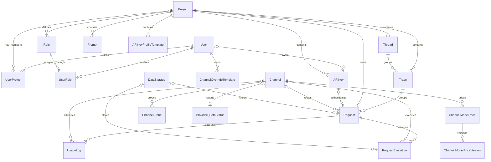

# AxonHub Entity Relationship Diagram (ERD)

## Purpose

This document gives a compact view of AxonHub's data domains and core relationships. It intentionally omits field inventories, database types, defaults, and indexes. The Ent schemas under `internal/ent/schema/` are the source of truth for those implementation details.

## Domain Overview

| Domain | Main entities | Responsibility |
|---|---|---|
| Identity and access | User, Project, UserProject, Role, UserRole, APIKey | Membership, authentication, ownership, and scoped access |
| Provider configuration | Model, Channel, ChannelModelPrice, ChannelModelPriceVersion | Available models, provider connections, and pricing |
| Request lifecycle | Request, RequestExecution, UsageLog | Inbound requests, provider attempts, usage, and cost |
| Observability | Thread, Trace, ChannelProbe, ProviderQuotaStatus | Request grouping and provider health |
| Storage and configuration | DataStorage, System, Prompt, PromptProtectionRule | Payload storage and reusable system configuration |
| Supporting access | OIDCIdentity, Invitation, APIKeyProfileTemplate, ChannelOverrideTemplate | Login identities, onboarding, and reusable templates |

## Core Relationships



## Relationship Notes

- A user can join multiple projects through `UserProject` and receive roles through `UserRole`.
- A role may be global or belong to a project; authorization is evaluated from ownership, membership, roles, and scopes.
- Every request belongs to a project. API key, trace, channel, and data-storage associations may be absent depending on the request source and processing stage.
- `Request` represents the client-facing operation. `RequestExecution` represents an individual provider attempt, so one request can have multiple executions because of retries or fallback.
- `UsageLog` records accounting data for a request and may attribute usage to a channel.
- `Thread` groups traces, and a trace groups related requests.

## Request Lifecycle

```text
API key or admin request
  -> Request
  -> one or more RequestExecution records
  -> UsageLog
```

Request and response payloads may remain in the primary database or be stored through `DataStorage`. The entity relationships remain the same in either case.

## Data Boundaries

- Project-owned records must retain their project scope throughout queries and mutations.
- Global resources such as channels, models, system settings, and data-storage definitions can be shared across projects, subject to authorization.
- Soft deletion is applied by the Ent schemas where historical identity or uniqueness must be preserved.

## Source of Truth

Use this document for domain orientation only. For exact fields, constraints, indexes, and generated database definitions, consult:

- `internal/ent/schema/` — authored entity definitions and relationships
- `internal/ent/migrate/schema.go` — generated migration schema
- `internal/server/biz/` — lifecycle and business invariants

## Related Resources

- [Transformation Flow Architecture](transformation-flow.md)
- [Fine-grained Permission Guide](../guides/permissions.md)
- [Tracing Guide](../guides/tracing.md)
