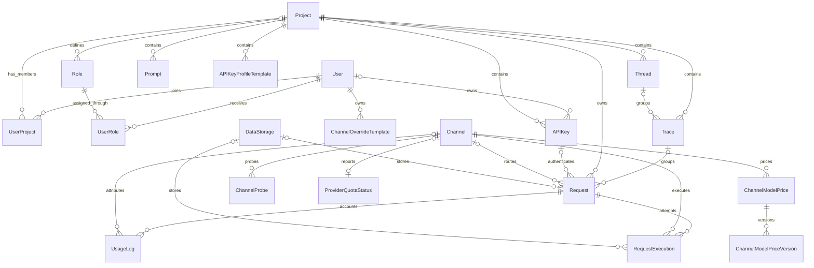

# AxonHub 实体关系图（ERD）

## 文档目的

本文档用于简要说明 AxonHub 的数据域和核心实体关系，不维护字段清单、数据库类型、默认值或索引。相关实现细节以 `internal/ent/schema/` 下的 Ent schema 为准。

## 数据域概览

| 数据域 | 主要实体 | 职责 |
|---|---|---|
| 身份与访问控制 | User、Project、UserProject、Role、UserRole、APIKey | 成员关系、认证、所有权和作用域权限 |
| 提供商配置 | Model、Channel、ChannelModelPrice、ChannelModelPriceVersion | 可用模型、提供商连接和定价 |
| 请求生命周期 | Request、RequestExecution、UsageLog | 入站请求、提供商执行、用量和成本 |
| 可观测性 | Thread、Trace、ChannelProbe、ProviderQuotaStatus | 请求分组和提供商健康状态 |
| 存储与配置 | DataStorage、System、Prompt、PromptProtectionRule | 请求载荷存储和可复用系统配置 |
| 辅助访问能力 | OIDCIdentity、Invitation、APIKeyProfileTemplate、ChannelOverrideTemplate | 登录身份、邀请和可复用模板 |

## 核心实体关系



## 关系说明

- 用户通过 `UserProject` 加入多个项目，并通过 `UserRole` 获得角色。
- 角色可以是全局角色，也可以属于特定项目；权限由所有权、成员关系、角色和 scopes 共同决定。
- 每个请求都属于一个项目。API Key、Trace、Channel 和 DataStorage 关联可能因请求来源或处理阶段而为空。
- `Request` 表示面向客户端的一次请求，`RequestExecution` 表示一次具体的提供商执行；重试或故障转移会产生多个执行记录。
- `UsageLog` 保存请求的计量信息，并可将用量归属到具体渠道。
- `Thread` 用于组织 Trace，Trace 用于组织相关 Request。

## 请求生命周期

```text
API Key 或管理员请求
  -> Request
  -> 一个或多个 RequestExecution
  -> UsageLog
```

请求与响应载荷可以保存在主数据库，也可以通过 `DataStorage` 存储；两种方式不会改变实体关系。

## 数据边界

- 项目级数据在查询和写入过程中必须保持项目作用域。
- Channel、Model、System 和 DataStorage 定义等全局资源可以由多个项目共享，但仍受权限控制。
- 需要保留历史身份或唯一性语义的实体，由 Ent schema 配置软删除。

## 事实来源

本文档只用于理解数据域。精确字段、约束、索引和生成后的数据库定义请查看：

- `internal/ent/schema/`：手工维护的实体定义和关系
- `internal/ent/migrate/schema.go`：生成的迁移 schema
- `internal/server/biz/`：生命周期和业务约束

## 相关资源

- [转换流程架构](transformation-flow.md)
- [细粒度权限指南](../guides/permissions.md)
- [追踪指南](../guides/tracing.md)
